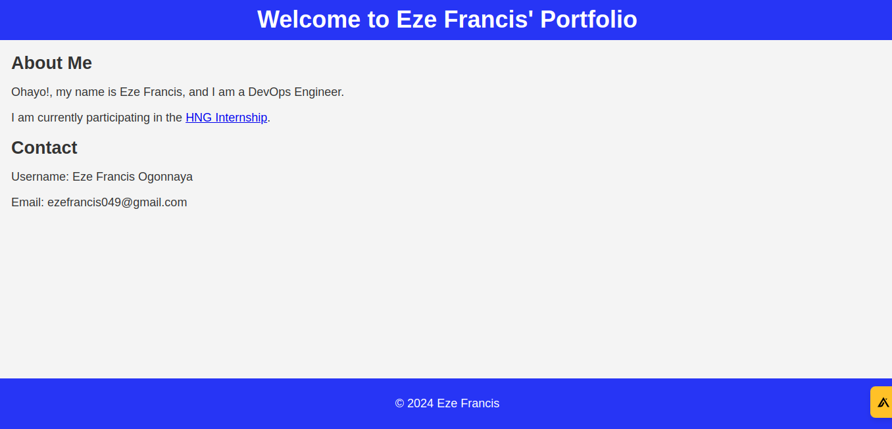

# hng-devops-stage-0

## Task: Static Website Deployment

In this stage, you'll step into the shoes of a DevOps engineer and deploy a static website onto a cloud platform.

### Requirements

- Cloud Platform: Choose a cloud platform of your preference (AWS EC2, Azure, etc) to deploy your website.
- Web Server: Select a web server software like NGINX or Apache to serve your static website content.
- Website Preparation: Ensure your static website files (HTML, CSS, Javascript) are ready for deployment.
- Server Configuration: Configure the chosen web server (NGINX or Apache) on your cloud instance to serve your website content.

### Acceptance Criteria

- Successful Deployment: Your static website is accessible through a public IP address or a domain name after deployment. The IP address shouldn’t include ports asides port 80.
- Web Server Configuration: The chosen web server (NGINX or Apache) is configured correctly to serve your website content.

## An Overview

This repository contains a static website deployed on a Digital Ocean Droplet using NGINX. You need to spin up a droplet instance,follow the steps to add an ssh key before accessing the console.

## Prerequisites

- A Digital Ocean Account
- Digital Ocean Droplet
- SSH access to the Droplet instance

## Directory Structure

```

hng-devops_stage-0/
├── style/
│   └── style.css
├── index.html
├── README.md

```

## Serving your static files

- Update your server

```bash
sudo apt update
sudo apt upgrade -y
```

- Install Nginx

```bash
sudo apt install nginx -y
```

- Allow NGINX through the server's firewall

```bash
sudo ufw allow 'Nginx HTTP'
sudo ufw enable
sudo ufw status
```

- Clone the project from GitHub and move it the var directory where the static files can be accessed by NGINX

```bash
git clone https://github.com/BjornOnGit/hng-devops_stage_0.git
mv hng-devops_stage_0 /var/www/html/
```

- Configure NGINX to serve the static website using the template below:

```bash
nano /etc/nginx/sites-available/hng-stage-0
```

- Enable the NGINX configuration

```bash
sudo ln -s /etc/nginx/sites-available/hng-stage-0 /etc/nginx/sites-enabled/hng-stage-0
```

- Remove the default NGINX configuration so as to force NGINX to listen through port 80 through our NGINX configuration

```bash
sudo rm /etc/nginx/sites-enabled/default
sudo rm /etc/nginx/sites-available/default
```

- Restart NGINX

```bash
systemctl restart nginx
```

## NGINX Configuration Template

Creating the NGINX configuration template:

```nginx
server {
    listen 80;
    listen [::]:80;

    root /var/www/html/hng-devops_stage_0;
    index index.html;

    location / {
        try_files $uri $uri/ =404;
    }

    location ~* \.(css|js|png|jpg|jpeg|gif|ico|svg|webp|ttf|woff|woff2|eot)$ {
        try_files $uri $uri/ =404;
        expires 30d;
        access_log off;
    }
}
```

## Site Preview



This documentation will help you install NGINX, clone your project from GitHub, configure NGINX to serve your static site, and restart NGINX to apply the configuration.
